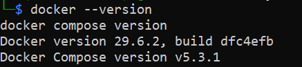

# 🛡️ Kali Linux (WSL) + Docker + SafeLine WAF — Home Lab Setup

Documentation of building a mini web security lab on a Windows 11 laptop using **Kali Linux (WSL2)**, **Docker**, and **SafeLine WAF**, including Penetration testing against common web attacks (XSS, SQL Injection, File Inclusion).

---

## 📋 Table of Contents

- [Laptop Specifications](#-laptop-specifications)
- [Architecture](#-architecture)
- [Installation](#-installation)
  - [1. Install Kali Linux via WSL](#1-install-kali-linux-via-wsl)
  - [2. Configure WSL Resources](#2-configure-wsl-resources)
  - [3. Install Basic Tools](#3-install-basic-tools)
  - [4. Install Docker](#4-install-docker)
  - [5. Install SafeLine WAF](#5-install-safeline-waf)
- [Penetration Testing](#-penetration-testing)
- [Test Results](#-test-results)
- [Troubleshooting](#-troubleshooting)
- [Security Notes](#-security-notes)

---

## 💻 Laptop Specifications

| Component | Detail |
|---|---|
| Model | Axioo Hype 5 AMD X5-2 |
| Processor | AMD Ryzen 5 7430U (12 threads, ~2.3GHz) |
| RAM | 8 GB |
| OS | Windows 11 Pro (Build 26200) |
| Storage | SSD NVMe (>900GB free) |

**Feasibility conclusion:** This spec is sufficient to run WSL2 + Kali Linux + Docker + SafeLine WAF simultaneously for learning/testing purposes, provided RAM is managed carefully (limit WSL memory allocation & close other heavy applications during installation).

---

## 🏗️ Architecture

```
Laptop (Windows 11)
└── WSL2
    └── Kali Linux Rolling 2026.2
        └── Docker Engine
            └── SafeLine WAF (containers: mgt, tengine, detector, postgres, etc.)
                 │
                 ├── Listening Port: 8080 (HTTP)
                 │
                 └── Reverse Proxy ──► Python Test Web Server (port 8000)
```

Incoming traffic goes through SafeLine (port 8080) → gets analyzed → forwarded to the actual website (port 8000) if safe, or blocked if an attack is detected.

---

## 🚀 Installation

### 1. Install Kali Linux via WSL

```powershell
wsl --install kali-linux
```

Set up username & password when prompted on first launch.

### 2. Configure WSL Resources

Create/edit the `.wslconfig` file in `%UserProfile%`:

```ini
[wsl2]
memory=3GB
processors=4
swap=2GB
```

Apply the changes from PowerShell:
```powershell
wsl --shutdown
```

### 3. Install Basic Tools

Enter Kali (`wsl -d kali-linux`), then:

```bash
sudo apt update
sudo apt full-upgrade -y
sudo apt install git python3-pip nmap gobuster sqlmap wireshark curl wget -y
```

### 4. Install Docker

```bash
# Dependencies
sudo apt install ca-certificates curl gnupg -y

# Official Docker GPG key
sudo install -m 0755 -d /etc/apt/keyrings
curl -fsSL https://download.docker.com/linux/debian/gpg | sudo gpg --dearmor -o /etc/apt/keyrings/docker.gpg
sudo chmod a+r /etc/apt/keyrings/docker.gpg

# Docker repository (Debian base)
echo \
  "deb [arch=$(dpkg --print-architecture) signed-by=/etc/apt/keyrings/docker.gpg] https://download.docker.com/linux/debian \
  bookworm stable" | sudo tee /etc/apt/sources.list.d/docker.list > /dev/null

# Install Docker + Compose plugin
sudo apt update
sudo apt install docker-ce docker-ce-cli containerd.io docker-buildx-plugin docker-compose-plugin -y

# Enable Docker
sudo systemctl enable --now docker
```

Verify:
```bash
docker --version
docker compose version
sudo docker run hello-world
```
<p align="center">
  
</p>

### 5. Install SafeLine WAF

```bash
sudo bash -c "$(curl -fsSLk https://waf.chaitin.com/release/latest/manager.sh)" -- --en
```

Select menu **`1. INSTALL`**, use the default path (`/data/safeline`). Once complete, admin credentials will be displayed:

```
Username: admin
Password: <auto-generated>
Dashboard: https://localhost:9443/
```

> ⚠️ Change the default password immediately after your first login.

#### Set Up an Application in SafeLine (Reverse Proxy)

In the SafeLine dashboard → **Applications → Add Application**:

| Field | Value |
|---|---|
| Domain | `127.0.0.1` |
| Listening Port | `8080` (HTTP) |
| Mode | Reverse Proxy |
| Upstream | `http://127.0.0.1:8000` |
| Application Name | Test Web Demo |

---

<p align="center">
  
</p>

## 🎯 Penetration Testing

### Start the Target Web Server ("attacked website")

```bash
mkdir ~/testweb
cd ~/testweb
echo "<h1>Hello, Demo Site</h1>" > index.html
python3 -m http.server 8000
```

Protected access (via SafeLine): `http://127.0.0.1:8080`

### Attack Payloads Tested

**XSS (Cross-Site Scripting)**
```
http://127.0.0.1:8080/?q=<script>alert(1)</script>
```

**SQL Injection**
```
http://127.0.0.1:8080/?id=1' OR '1'='1
```

**Path Traversal / File Inclusion**
```bash
curl --path-as-is "http://127.0.0.1:8080/?file=../../../../etc/passwd"
```

---

## ✅ Test Results

| Attack Type | Status | Detected As |
|---|---|---|
| XSS | ✅ **Blocked** | XSS |
| SQL Injection | ✅ **Blocked** | SQL Inj |
| Path Traversal (via parameter) | ✅ **Blocked** | File Include |

All attack attempts were successfully detected and blocked by SafeLine WAF before reaching the target web server, and were fully logged in the dashboard (Action, URL, Attack Type, IP Address, Time).

---

## 🔧 Troubleshooting

| Issue | Cause | Solution |
|---|---|---|
| `docker-compose-plugin has no installation candidate` | Kali's default repo doesn't always have the latest package | Install Docker from the official Docker repo (see [step 4](#4-install-docker)) |
| `systemctl` fails (`System has not been booted with systemd`) | systemd isn't active in WSL | Check with `ps -p 1 -o comm=`; if it's not `systemd`, add `[boot]\nsystemd=true` to `/etc/wsl.conf`, then `wsl --shutdown` |
| SSL Cert error when adding an application | Port 443 (HTTPS) enabled without a certificate | Remove the 443 listening port if only HTTP is needed for testing |
| Path traversal via direct URL isn't detected | Browser/curl normalizes `../` before sending the request | Use `curl --path-as-is`, or test via a parameter instead (`?file=../../etc/passwd`) |

---

## ⚠️ Security Notes

- This setup is intended for **learning and local experimentation**, not production use.
- Do not expose the SafeLine port (9443) or the test application to a public network/the internet without additional hardening.
- Always change the default SafeLine password after installation.
- For production needs (protecting real traffic at high volume), use a separate server/VPS with more resources (recommended: at least 4GB RAM, 2 dedicated vCPUs for SafeLine).

---

## 📚 References

- [SafeLine WAF — Official Documentation](https://docs.waf.chaitin.com/en/GetStarted/Deploy)
- [SafeLine WAF — GitHub](https://github.com/chaitin/SafeLine)
- [Microsoft WSL Documentation](https://learn.microsoft.com/en-us/windows/wsl/)
- [Kali Linux — WSL](https://www.kali.org/docs/wsl/)

---

*Built as personal home lab documentation — July 2026.*
